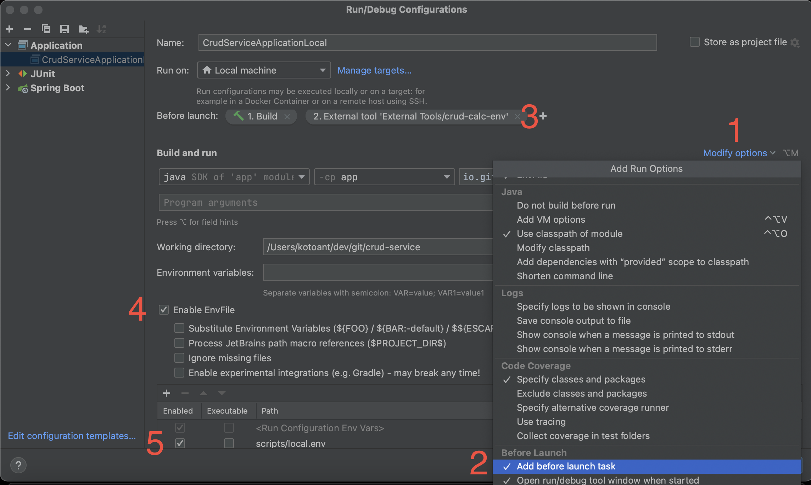

# crud-service

[![Build Status][build-status-image]][build-status-link]

Воркшоп «Разрабатываем и тестируем CRUD-сервис».
Видео-запись воркшопа на [YouTube](https://www.youtube.com/watch?v=M_qeoqZ1UAs).

В рамках воркшопа разберем полный цикл разработки и тестирования CRUD-сервиса. Сам сервис реализуем на Spring, логику
работы базы данных – на Jooq. Для локального запуска и тестирования будем использовать PostgreSQL и Testcontainers.
Схему и изменения кода базы данных будем накатывать с помощью Liquibase. На воркшопе будет продемонстрирована
Keyset-реализация постраничного отображения данных, которая в отличие от Offset-реализации работает одинаково эффективно
вне зависимости от номера отображаемой страницы.

## Полезные ссылки

1. Илья Сазонов и Федор Сазонов — Offset и keyset: почём пагинация для продакшена?
   [Видео](https://www.youtube.com/watch?v=wi6h9ox1wwM),
   [Описание](https://jpoint.ru/talks/7c6a25d123b441c68a48c1da157e3f38/),
   [PDF](https://squidex.jugru.team/api/assets/srm/cea09505-41f2-4df7-8024-cafe1fa5dd87/ilsya-i-fedor-sazonovy.pdf).
2. Иван Пономарёв — Скрытая сложность повседневной задачи: отображение табличных данных
   [Видео](https://www.youtube.com/watch?v=h5PpZxYsEvc),
   [Описание](https://2017.jpoint.ru/talks/hidden-complexity-of-a-routine-task-presenting-table-data-in-user-interface/),
   [PDF](https://assets.contentful.com/oxjq45e8ilak/7EAbhXIGD6gAi0q2cC8cwI/c99868730d5ec430c3f8cc2bf4f6e776/Ivan_Ponomarev_Hidden_complexity_of_a_routine_task_presenting_table_data_in_user_interface.pdf).

## План воркшопа

1. Посмотрим АПИ:
    1. Code First: схему и модель опишем в java коде.
    2. Сгенерируем openapi yaml файл.
2. Напишем основную логику:
    1. Liquibase: схема базы данных.
    2. Jooq: кодогенерация.
    3. Реализуем поочередно контроллер, сервис, репозиторий.
3. Напишем тесты:
    1. Testcontainers: postgres.
    2. Тесты на пролистывание вперед и назад.

## Схема для объяснения алгоритма построения запросов для страничного отображения

| Страница | created    | public_id | Комментарий   |
|----------|------------|-----------|---------------|
| prevPage | 23 октября | ff369c5c- | prevPageFirst |
| prevPage | 23 октября | e1666e11- |               |
| -------- | ---------- | --------- | ------------- |  
| currPage | 23 октября | d5fe86d2- | pageToken     |
| currPage | 22 октября | c37abbdd- |               |
| currPage | 22 октября | aff2d7cd- |               |
| currPage | 21 октября | a22cdfa2- |               |
| -------- | ---------- | --------- | ------------- |  
| nextPage | 21 октября | 63a4c167- | nextPageFirst |
| nextPage | 21 октября | 639d894c- |               |
| nextPage | 21 октября | 10abc155- |               |

# Тех стек

* [Java 21](https://adoptium.net/temurin/releases/)
* [Spring Boot 3](https://spring.io/projects/spring-boot)
* [Liquibase](https://www.liquibase.org/)
* [Postgres 15](https://www.postgresql.org/)
* [Jooq](https://www.jooq.org/)
* [Maven](https://maven.apache.org/)
* [Docker](https://www.docker.com/get-started)
* [Testcontainers](https://www.testcontainers.org/)

# Предварительные требования

* Git - https://git-scm.com/downloads
* Git LFS - https://git-lfs.github.com/
* Java 21 - https://adoptium.net/temurin/releases/
* Maven 3 - https://maven.apache.org/download.cgi
* Docker - https://www.docker.com/get-started

## Установка для MacOS / Linux / Cygwin (Windows)

* Homebrew (только для MacOS) - https://brew.sh/

```
/bin/bash -c "$(curl -fsSL https://raw.githubusercontent.com/Homebrew/install/master/install.sh)"
```

Если вы видите сообщение с ошибкой: 'Can’t install the software because it is not currently available from the Software
Update server.' во время установки macos command line tools вы можете скачать и установить Command Line Tools for
Xcode отсюда https://developer.apple.com/downloads/index.action

* Git LFS

Для MacOS:

```
brew install git-lfs
git lfs install
```

* Sdkman: https://sdkman.io/install

```
curl -s "https://get.sdkman.io" | bash
```

Следуйте инструкциям на экране для завершения установки. Обратите внимание, что в конце возможно потребуется выполнить
несколько действий - в этом случае об этом скажет процесс установки в конце. Например, выполнить в терминале команду:

```
source "$HOME/.sdkman/bin/sdkman-init.sh"
```

А также для корректной установки sdkman может потребоваться добавить следующие строки в конец файла `~/.zshrc`, если вы
используете zsh в качестве командной оболочки по умолчанию или `~/.bashrc` - если используете bash:

```
#THIS MUST BE AT THE END OF THE FILE FOR SDKMAN TO WORK!!!
export SDKMAN_DIR="$HOME/.sdkman"
[[ -s "$SDKMAN_DIR/bin/sdkman-init.sh" ]] && source "$SDKMAN_DIR/bin/sdkman-init.sh"
```

* Java: https://sdkman.io/jdks#tem

```
sdk list java
sdk install java 21-tem
```

* Maven: https://sdkman.io/sdks#maven

```
sdk install maven
```

* Docker

Для сборки проекта в тестах используется TestContainers, в котором поднимается база данных. Также для локального запуска
сервиса потребуется запустить базу данных - опять-таки удобно это делать через docker. Более того конфигурация проекта
позволяет легко переиспользовать один и тот же экземпляр контейнера с базой данных как между различными запусками
тестов, так и между локальными запусками приложения.

## Варианты установки Docker

1. [Docker Desktop](https://www.docker.com/products/docker-desktop/) - запрещено использование в коммерческих проектах
   без лицензии, которую не получить. Поэтому этот способ подходит только для некоммерческого использования.
2. [Rancher Desktop](https://rancherdesktop.io/) - корректно работает только для Mac на процессоре Intel. Если у вас
   процессор Apple Silicon, то этот вариант вам не подходит - есть почти постоянные ошибки в сетевой инфраструктуре.
3. [Colima](https://github.com/abiosoft/colima#installation) - рабочий вариант для владельцев Mac на процессоре Apple
   Silicon. Потребуется лишь слегка настроить окружение, чтобы с таким docker заработали Testcontainers:

### Настройка окружения для Colima

В случае, если вы работаете Colima реализацией docker, необходимо настроить переменные окружения в файле `~/.zshrc` (
или `~/.bashrc`):

```
# https://vividcode.io/colima-apple-m-1-and-testcontainers/
export DOCKER_HOST=unix://${HOME}/.colima/default/docker.sock
export TESTCONTAINERS_DOCKER_SOCKET_OVERRIDE=/var/run/docker.sock
export TESTCONTAINERS_RYUK_DISABLED=true
```

## Настройка Git

* [Сконфигурировать SSH ключи](https://docs.gitlab.com/ee/ssh/)
* Клонировать репозиторий и выполнить git lfs pull:

```
git clone git@github.com:kotoant/crud-service.git
cd crud-service
git lfs install
git lfs pull
```

* [Настроить Git username/email для коммитов](https://docs.gitlab.com/ee/gitlab-basics/start-using-git.html#configure-git):

```
git config user.name "Firstname Lastname"
git config user.email "login@email.domain"
```

# Инструкции Сборки и Запуска

### Сборка проекта

Для сборки всего проекта выполните следующую команду в корневой директории проекта:

`mvn clean install`

При сборке автоматически поднимется контейнер с образом postgres, на него накатятся изменения через liquibase и
прогонятся тесты.

Чтобы этот контейнер можно было автоматически переиспользовать между различными запусками, необходимо один раз настроить
testcontainers - а именно создать в домашней директории файл `~/.testcontainers.properties` со следующей настройкой:

```
testcontainers.reuse.enable=true
```

Для `Windows` домашняя директория находится обычно здесь: `C:\Users\yourusername`.

Чтобы принудительно погасить контейнер при сборке на фазе clean можно активировать профиль
stop-and-remove-testcontainers:

`mvn clean install -P stop-and-remove-testcontainers`

Также можно погасить запущенный контейнер через скрипт:

`./scripts/stop-and-remove-testcontainers.sh`

Для работы bash-скриптов в `Windows` команды нужно запускать в оболочке `cygwin` (или `mingw`). Чтобы команды работали
прямо в
терминале Intellij IDEA можно в настройках `Tools -> Terminal` указать в качестве `Shell path` путь до `bash.exe` из
`cygwin` (или `mingw`).

#### Локальный запуск приложения

###### **Подготовка окружения**

Локальный запуск подразумевает, что ранее, например через тесты, был запущен контейнер с базой данных в reuse режиме
(см. выше). Для запуска приложению необходимо знать локальный порт, на котором принимает соединения база данных. Так как
testcontainers выбирает порт при запуске динамически произвольным образом, то необходимо перед запуском сервиса
вычислить этот порт. Это можно сделать с помощью скрипта:

`./scripts/calc-local-docker-env.sh`

После запуска скрипта в директории `scripts` появится файл `local.env` с вычисленными параметрами, например:

```
DB_HOST=localhost:32822
```

Перед каждым локальным запуском сервиса, если контейнер с базой пересоздавался, то есть запускался на новом порту, то
необходимо перевычислять этот порт и обновлять переменную окружения для последующего запуска сервиса. Этот процесс можно
полностью автоматизировать - достаточно лишь будет нажать одну кнопку в Intellij IDEA:

###### **Конфигурация для локального запуска**

Для локального запуска через IDEA необходимо использовать класс `CrudServiceApplicationLocal`. Также предварительно
необходимо установить EnvFile плагин для IDEA: https://plugins.jetbrains.com/plugin/7861-envfile

Настройка параметров запуска для класса `CrudServiceApplicationLocal`:

1. Modify Options
2. Add before launch task
3. External Tool: выбрать скрипт `./scripts/calc-local-docker-env.sh` (для `Windows` выбрать `bash.exe` из cygwin/mingw
   и в
   качестве аргумента - путь к скрипту)
4. Enable EnvFile
5. Выбрать ранее сгенерированный скрипт `scripts/local.env`



Если нет возможности автоматизировать вычисление параметров окружения по какой-то причине (например не работают
sh-скрипты на windows), то можно просто перед запуском сервиса посмотреть в докере порт, к которому привязан контейнер,
и задать переменную окружения в параметрах запуска в Intellij IDEA, например:

```
DB_HOST=localhost:32822
```

При запуске сконфигурированного профиля сервис запустится на локальном порту 8080.

###### **Swagger UI**

Swagger UI здесь: [http://localhost:8080/crud/swagger-ui/index.html](http://localhost:8080/crud/swagger-ui/index.html).

###### **OpenAPI файл**

OpenAPI файл в json формате доступен по
адресу [http://localhost:8080/crud/v3/api-docs](http://localhost:8080/crud/v3/api-docs),
в yaml формате - [http://localhost:8080/crud/v3/api-docs.yaml](http://localhost:8080/crud/v3/api-docs.yaml).

[build-status-image]: https://github.com/kotoant/crud-service/actions/workflows/maven-build.yml/badge.svg
[build-status-link]: https://github.com/kotoant/crud-service/actions/workflows/maven-build.yml
